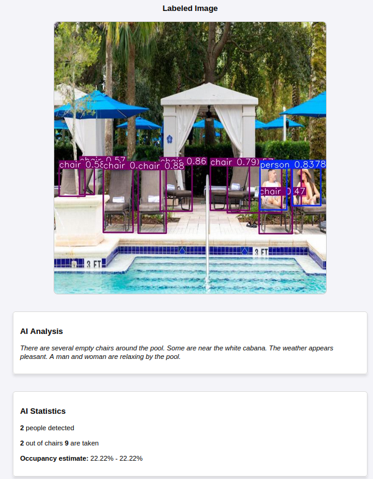

# Pool Area Occupancy AI System

Web-based AI system analyzing the occupancy of pool areas. It detects the number of people, chairs, and their occupancy status. It also provides insights (e.g., demographics) with a multi-modal LLM.

The project consists of:
- **Frontend**: A barebone interface supporting file uploads and gallery image selection.
- **Backend**: Provides statistics and insights using YOLO, Gemini, and some geometric processing.

<p align="center">
  
</p>

## Prerequisites
1. **Docker**: Install Docker and Docker Compose.
2. **YOLO**: The code downloads YOLO11x (i.e., the latest at the time of writing).
3. **Gemini API Key**: Add your API key to your environment.

## How to use

1. Clone the repository:
   ```bash
   git clone https://github.com/your-repo/chair-occupancy-ai.git
   cd chair-occupancy-ai
   ```

2. Add your Gemini API key to the `.env` file:
   ```bash
   echo "GEMINI_API_KEY=your_api_key_here" > .env
   ```

3. Start the application:
   ```bash
   ./run.sh
   ```

4. Access the frontend at localhost.
5. Upload an image or select one from the gallery.
6. Alternatively, you can access the backend API directly at `/docs` for testing.

## API Endpoints
- **Analyze Image**: `POST /analyze-image`
  - Input: Image file.
  - Output: Detection results and labeled image.

- **AI Analysis**: `POST /llm-analyze`
  - Input: Image file.
  - Output: GenAI insights.

## Tech Stack
- **AI Models**: YOLO, Google Gemini
- **Backend**: FastAPI, Python
- **Frontend**: HTML, CSS, JavaScript
- **Docker**: For containerization
